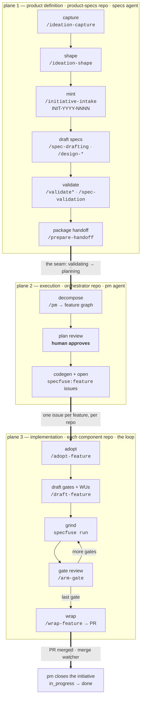
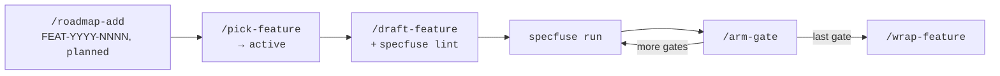

<!--
Copyright 2026 Specfuse Contributors
Licensed under the Apache License, Version 2.0. See LICENSE.
-->

# Product lifecycle — from idea to merged code

One idea's journey across both planes: captured in a backlog, shaped, minted as an
initiative, specified, validated, handed to the orchestrator, decomposed into
features, dispatched into component repos, and ground out by the loop.

This file owns one thing: **the ordered path, and the command that moves each
step.** It does not define the units (that is
[`methodology/glossary.md`](../methodology/glossary.md)), the state machines
([`unit-lifecycles.md`](unit-lifecycles.md)), the contracts
([`methodology/methodology.md`](../methodology/methodology.md)), or the operating
cadences ([`ways-of-working.md`](ways-of-working.md)). It links rather than
restates.

Commands appear under their plugin namespace — `/specfuse-authoring:…`,
`/specfuse-orchestrator:…`, `/specfuse:…`. Install per repo via the marketplace;
see the [README](../README.md#plugins).

---

## 1. The path at a glance



Three planes, two seams. The seams are where a document changes repos and an
agent hands to another agent — they are the only places the flow can silently
stall, so both are covered in full below (§7 and §9).

## 2. Stage table

| # | Stage | Who | Lives in | Command | Produces | Unit state after |
|---|---|---|---|---|---|---|
| 1 | Capture | human + specs | product-specs repo | `/specfuse-authoring:ideation-capture` | index row + stub dossier | idea `idea` |
| 2 | Shape | human + specs | product-specs repo | `/specfuse-authoring:ideation-shape` | filled dossier, readiness checklist | idea `shaping` → `ready` |
| 3 | Groom | specs | product-specs repo | `/specfuse-authoring:backlog-groom` | triage report | (`parked` / `dropped` as needed) |
| 4 | Mint | specs | orchestrator repo | `/specfuse-authoring:initiative-intake` | `INIT-YYYY-NNNN` registry entry, `initiative_created` | initiative `drafting` |
| 5 | Draft | human + specs | product-specs repo | `/specfuse-authoring:spec-drafting`, `design-scenario`, `design-async`, `design-recipe` | OpenAPI / AsyncAPI / Arazzo under `/product/` | initiative `drafting` |
| 6 | Validate | specs | product-specs repo | `/specfuse-authoring:validate`, `validate-async`, `validate-scenarios`, `spec-validation` | validation verdict, `validation_passed` | `drafting → validating → planning` |
| 7 | Handoff | specs | product-specs → orchestrator | `/specfuse-authoring:prepare-handoff` | handoff manifest + registry entry | initiative `planning` |
| 8 | Decompose | pm | orchestrator repo | `/specfuse-orchestrator:pm` | feature graph `INIT-…/FNN`, plan-review file | `planning → plan_review` |
| 9 | Approve | **human** | orchestrator repo | (answer in the pm session) | approval | `plan_review → generating` |
| 10 | Generate + dispatch | pm | orchestrator repo → GitHub | `/specfuse-orchestrator:pm` | generated code, `specfuse:feature` issues | `generating → in_progress` |
| 11 | Adopt | human | component repo | `/specfuse:adopt-feature` | loop-feature folder, WU-01 seeded from the issue body | loop feature `active` |
| 12 | Plan | human + loop | component repo | `/specfuse:draft-feature`, `specfuse lint` | gate skeleton + gate 1 WUs | WUs `draft` → `ready` |
| 13 | Grind | driver | component repo | `specfuse run` | commits, `events.jsonl` | WUs → `done`, gate `awaiting_review` |
| 14 | Gate review | human | component repo | `/specfuse:arm-gate` | next gate's WUs accepted | gate `passed`, next gate `open` |
| 15 | Wrap | human | component repo | `/specfuse:wrap-feature` | branch pushed, PR opened, CI watched | loop feature `done` |
| 16 | Close | merge watcher, then pm | GitHub → orchestrator | (automatic) + `/specfuse-orchestrator:pm` | cross-component retro, root `LEARNINGS.md` | task `done`, initiative `in_progress → done` |

Stages 1–3 are **pre-intake**: no correlation ID exists yet, nothing is
committed to, and the orchestrator repo is never touched. That is the point —
the backlog's job is to lose no idea, not to make every idea real.

---

## 3. Stages 1–3 — pre-intake ideation

Everything here is local to the product-specs repo, cheap, and reversible.

**Capture** (`/specfuse-authoring:ideation-capture`) is frictionless by design: a
title and whatever blurb the human volunteers. It allocates the next sequential
`IDEA-NNN`, appends one row to `docs/product/INITIATIVE_BACKLOG.md`, and creates
a stub dossier at `docs/product/backlog/IDEA-NNN-<slug>.md`. Both start at state
`idea`. No interrogation, no readiness assessment, no `INIT-` mint. A dossier
that is nothing but template placeholders is a valid `idea`-state dossier.

**Shape** (`/specfuse-authoring:ideation-shape`) is the interrogation: it fills
the dossier, drives a four-point readiness checklist, and walks `idea → shaping →
ready`. Every clause it writes must trace to a file or to a human answer —
inventing product intent is the failure this skill guards against. It also
records a decision to **bundle** several ideas into one initiative (lead
`bundles:` / follower `bundled_into:`). It stops at `ready`; it never mints.

**Groom** (`/specfuse-authoring:backlog-groom`) is the periodic sweep, not part
of any single idea's path: it surfaces ready-to-mint items, flips stale ones to
`parked`, and flags internal dupes, items overtaken by minted work, under-shaped
`ready` entries, bundle drift, and orphaned dossiers. Report-first and
read-mostly — it writes only the backlog index and never deletes a row or a
dossier. Its roadmap analogue is the PM's `roadmap-sync`.

`IDEA-NNN` ids are **transient**. They are not correlation IDs and nothing
downstream carries them.

## 4. Stage 4 — mint the initiative

`/specfuse-authoring:initiative-intake` is the entry point for the lifecycle
proper. It asks for three things and defaults none of them: the initiative title,
the involved repos (`owner/repo`, at least one), and the autonomy default
(`auto` / `review` / `supervised`).

It then mints `INIT-YYYY-NNNN` (per-year-resetting ordinal), writes the registry
entry to `/features/INIT-YYYY-NNNN.md` in the orchestrator repo, emits
`initiative_created`, and sets state `drafting`. This is the first cross-plane
write — the mint reaches into the execution plane's registry from the authoring
side, but it is **not** the seam (see §7).

No downstream skill — drafting, validation, planning — can operate until a valid
registry entry exists.

> **Substrate precondition.** Intake needs the shared substrate contract
> (`validate-frontmatter.py`, `feature-frontmatter.schema.json`,
> `feature-registry.md`) which the authoring plugin does not itself ship. It
> checks *before* minting, and stops with no id burned if anything is
> unresolvable. Reading those artifacts out of a sibling `../orchestrator/`
> checkout is the dependency inversion being removed, not a workaround —
> see [`specfuse/specfuse#119`](https://github.com/specfuse/specfuse/issues/119).

Once minted, flip the originating dossier to `minted`.

## 5. Stage 5 — draft the specs

`/specfuse-authoring:spec-drafting` runs the conversation in three phases —
feature scoping, spec drafting, pre-validation review — and keeps product
judgment with the human. Everything it writes lands under `/product/`.

The design skills do the specialized authoring:

| Skill | For |
|---|---|
| `/specfuse-authoring:design-scenario` | a behavioral Arazzo scenario, via an 11-step flow (intent → domain → inventory scan → actors → step walk → failure modes → generate → validate → Mermaid sanity check) |
| `/specfuse-authoring:design-async` | events, scheduled jobs (`run-*`), handlers in the v2 pub-sub architecture |
| `/specfuse-authoring:create-job` / `create-worker` | the two async shapes directly — cron fan-out dispatcher, or event-handler worker |
| `/specfuse-authoring:design-recipe` | an Arazzo setup recipe that provisions fixtures via real operations |
| `/specfuse-authoring:update-scenario` / `deprecate-scenario` | surgical edits and retirement of existing scenarios |
| `/specfuse-authoring:list-scenarios` | discovery — what coverage already exists, before authoring more |
| `/specfuse-authoring:review-scenario` | an independent cold review by the `scenario-reviewer` subagent |
| `/specfuse-authoring:preview` / `preview-async` | live doc preview on 8081 / 8082 while editing |

Endpoints and entities have no generator skill yet — author them by hand against
`handbooks/API_Handbook.md` and `samples/endpoint-samples.yaml`.

The specs agent's write surface is `/product/` and the ideation backlog, and
nothing else: never `/business/`, never `/product/test-plans/` (that subtree is
the QA agent's).

## 6. Stage 6 — validate

Three validators, by artifact kind:

```
/specfuse-authoring:validate             # OpenAPI: bundle, structure, generator, Specfuse validator, Spectral, Redocly
                                         #   (+ AsyncAPI if async specs exist)
/specfuse-authoring:validate-async       # AsyncAPI: bundle, structural, Spectral
/specfuse-authoring:validate-scenarios   # Arazzo: Spectral + operationId/event resolution, recipe chains, granularity
```

`/specfuse-authoring:spec-validation` wraps them for the lifecycle: it invokes
validation, interprets failures through a common-error table, and owns the two
state transitions — `drafting → validating` (`validation_requested`) and
`validating → planning` (`validation_passed`).

`validating → planning` is the plane handoff. Everything after it belongs to the
execution plane.

## 7. Stage 7 — the seam

`/specfuse-authoring:prepare-handoff` packages the validated initiative for
downstream implementation. It runs the full validation suite, regenerates
scenario docs and bundles, builds the operation / async / entity / scenario
inventories plus the prompt index, and delegates manifest composition to the
`handoff-composer` subagent. Output: a manifest at
`api/docs/handoffs/<correlation-id>.md` conforming to the orchestrator's
`project/specs-handoff-contract.md`, plus the registry entry.

Flags worth knowing: `--dry-run` (compose but write nothing — use it the first
few times), `--scope <paths>` (override scope derivation), `--since <ref>`
(override the diff base, default `origin/main`).

Two things about the seam that are commonly misread:

- **The mint is not the seam.** `initiative-intake` writes the orchestrator
  registry *before* the boundary. The boundary is the `validating → planning`
  transition — that is where ownership moves from specs to pm.
- **Gates live in the loop, not the orchestrator.** The orchestrator owns
  initiative→feature decomposition and cross-repo ordering. It does not identify
  gates, run `plan-next`, or hold a per-gate review.
  ([addendum](../methodology/concepts/architecture-addendum-gates-and-iterative-planning.md))

Decision record:
[`decision-authoring-execution-boundary.md`](https://github.com/specfuse/orchestrator/blob/main/docs/decision-authoring-execution-boundary.md).

## 8. Stages 8–9 — decompose and approve

`/specfuse-orchestrator:pm` is a read-and-act router over the PM role. Ask it a
status question and it inspects state; ask it to act and it runs one of the
transitions it owns.

Decomposition drafts the feature graph (`INIT-YYYY-NNNN/FNN`, one feature per
component repo, with `depends_on` edges), co-authors each work-unit prompt with
the human, and materializes the plan-review file — `planning → plan_review`.

Before that flip the PM verifies the graph round-trips the registry schema with
no orphan `depends_on` and no cycles, and that Specfuse template coverage exists
for every target component repo.

**The PM never self-approves.** `plan_review → generating` is the human's call,
answered in the session. This is the single most consequential human checkpoint
in the whole path — it is where a bad decomposition is still cheap.

While drafting, read
[`/specfuse:authoring-work-units`](../plugins/specfuse/skills/authoring-work-units/SKILL.md):
it is the reference for what makes a WU prompt that neither blocks spuriously nor
passes hollowly, and it applies to PM-drafted prompts as much as to hand-written
ones.

## 9. Stage 10 — generate and dispatch

After approval the PM runs Specfuse codegen through the single `generate.sh`
entry, opens the first round of feature issues, then flips `generating →
in_progress` on first task opened.

Two facts govern everything downstream:

- **Generated directories are never-touch.** Codegen freezes the cross-repo
  interface; a component repo edits generated output only by changing the spec
  and regenerating. ([`rules/never-touch.md`](../methodology/rules/never-touch.md))
- **A feature issue is a dispatch, and the issue body is the contract.** It is
  labelled `specfuse:feature` in the target component repo.

`pending → ready` on the feature graph is recomputed by the PM alone, and only
after inspecting each `depends_on` target's own issue directly. The registry is
not ground truth for target-repo state.

## 10. Stages 11–15 — the loop, in each component repo

This is the second seam: a GitHub issue becomes a loop feature.

**Adopt.** `/specfuse:adopt-feature` lists the repo's open `specfuse:feature`
issues as a numbered pick list and, on your explicit choice, scaffolds
`.specfuse/features/<FEAT-ID>-<slug>/` with `WU-01` seeded from the **raw issue
body, verbatim**. Run it interactively — `claude -p` with redirected stdin cannot
make a pick. If a feature is already `active`, the skill surfaces it first and
recommends finishing it.

**Plan.** `/specfuse:draft-feature` turns that seed into a real plan: the gate
skeleton, gate 1's work units, and the matching files. Keep ceremony
proportional — four or fewer planned substantive WUs means one gate with one
terminal close. Then `specfuse lint` the folder; it is far cheaper than a failed
dispatch.

**Grind.** `specfuse run --dry-run` first, then `specfuse run`. The driver walks
the gate's ready WUs, dispatches each as a fresh session, re-runs verification
itself as the exit oracle, and commits one squashed commit per unit. Failures
retry with the failure evidence attached, then escalate. One driver per working
tree — the driver holds an exclusive lock; concurrent features need separate
`git worktree` checkouts.

**Gate review.** Either the gate auto-closes (clean and on-plan, under `auto`
autonomy) or the driver halts at `awaiting_review` and `/specfuse:arm-gate` walks
the next gate's drafts: accept, revise, or reject each. Arming in under a minute
means the checkpoint has stopped existing.

**Wrap.** `/specfuse:wrap-feature` pushes the branch, opens the PR, optionally
watches CI, and points at the next pick.

When something stops unexpectedly: `/specfuse:gate-status` (read-only diagnosis
from WU statuses, `events.jsonl`, and per-attempt notes) and `/specfuse:attention`
(the local inbox of everything needing a human). Both are read-only.

## 11. Stage 16 — close

The merge watcher flips each task `in_review → done` when its PR merges and
branch protection is green. When the last feature reaches `done`, the PM runs the
brief cross-component retro, appends genuinely cross-component lessons to the
root `LEARNINGS.md`, and flips the initiative `in_progress → done`.

Then, on the authoring side, groom the backlog so the dossier that started all
this reads `minted` and no longer competes for attention.

---

## 12. The flows that run backwards

The path above is the happy line. These run against it, and skipping them is how
the method degrades:

| Flow | Trigger | Command | Direction |
|---|---|---|---|
| **Spec issue** | a component or QA agent finds the spec wrong | `/specfuse-authoring:spec-issue-triage` | execution → authoring |
| **Generator issue** | generated code is wrong but the spec is right | `/specfuse-authoring:file-generator-issue` | execution → generator repo |
| **Impact check** | an operationId, event, or schema is renamed or removed | `/specfuse-authoring:impact-scenarios` | within authoring, before the PR |
| **Escalation** | any agent hits something it must not decide | (writes to the human-escalation inbox) | any plane → human |
| **Block** | a named unmet dependency (an ADR, an upstream feature) | `/specfuse:block-feature` | within the loop |
| **Learnings** | recurring failure signatures across attempts | `/specfuse:learnings-suggest` then `/specfuse:learnings-curate` | loop → every future plan |

Spec-issue triage decides between four cases: a `/product/` content fix (edit,
re-validate, `spec_issue_resolved`), a generator-template fix (route an issue to
the generator repo, `spec_issue_routed`), a spec error that merely *surfaced* in
generated output (treat as the first case — the subtlest one), or ambiguous
(escalate). Inbox files move to `processed/`; they are never deleted.

Run **both** halves of the learnings loop. `LEARNINGS.md` is loaded whole into
every planning session, so an uncurated file silently degrades every future plan.

## 13. The short path — no initiative, no orchestrator

Most work never needs any of §3–§9. The loop is usable in one repo with no
specs and no orchestrator, and the orchestrator earns its keep only when work
genuinely spans repos.



And some work should not be a feature at all. Bugs get `/specfuse:fix-bug` — one
bug, one branch, one PR, test-first; it refuses and proposes promotion if the
work turns out to be genuinely large. Monitoring findings get
`/specfuse:diagnose-issue` before anyone decides whether to fix them. The
judgement call is size and risk, not category. See
[`ways-of-working.md` §7](ways-of-working.md).

Adoption-time, once per repo: `/specfuse:derive-verification` (make the
verification set match real CI) and `/specfuse:derive-monitoring` (if there are
deployed components). Periodically: `/specfuse:scaffold-upgrade`,
`/specfuse:roadmap-archive`, and the learnings pair.

## 14. Known rough edges

- **`prepare-handoff` assumes the sibling layout** `<project>App/{orchestrator,
  <project>-specs}/` and reads the contract from `../orchestrator/project/`. In
  any other layout it stops rather than guessing.
- **`initiative-intake` can be blocked by the substrate gap** described in §4.
  It fails loudly and before minting, which is the intended behavior, not a bug
  to work around.
- **The orchestrator's operator runbook predates the Model-B reframe** and still
  says `feature-intake` where the authoring plugin now ships
  `initiative-intake`. Same entry point, old name.
- **`spec-issue-triage` has never been exercised at runtime.** Treat the first
  real triage as a smoke test and report contract bugs upstream.

## 15. Where to read next

| Read | For |
| --- | --- |
| [`unit-lifecycles.md`](unit-lifecycles.md) | The state machines: every state of an idea, initiative, feature, gate, WU, and task, plus where each record lives on disk. |
| [`ways-of-working.md`](ways-of-working.md) | The cadence model — which of the four moments you are in, and the failure modes. |
| [`methodology/overview.md`](../methodology/overview.md) | Orientation: the bet, the five nouns, how the planes collaborate. |
| [`methodology/methodology.md`](../methodology/methodology.md) | The gate-cycle contract in full. |
| [`methodology/glossary.md`](../methodology/glossary.md) | Every unit defined once; correlation-ID reference. |
| [authoring getting-started](https://github.com/specfuse/authoring/blob/main/docs/getting-started.md) | Bootstrapping a product-specs repo and authoring a first domain. |
| [orchestrator operator runbook](https://github.com/specfuse/orchestrator/blob/main/docs/operator-runbook.md) | The specs-agent session, step by step. |
| [orchestrator pipeline reference](https://github.com/specfuse/orchestrator/blob/main/docs/operator-pipeline-reference.md) | Per-agent detail from `planning` onward, plus inbox and escalation flows. |
| [loop getting-started](https://github.com/specfuse/loop/blob/main/docs/getting-started.md) | A narrated first feature, end to end, including operating a running loop. |
