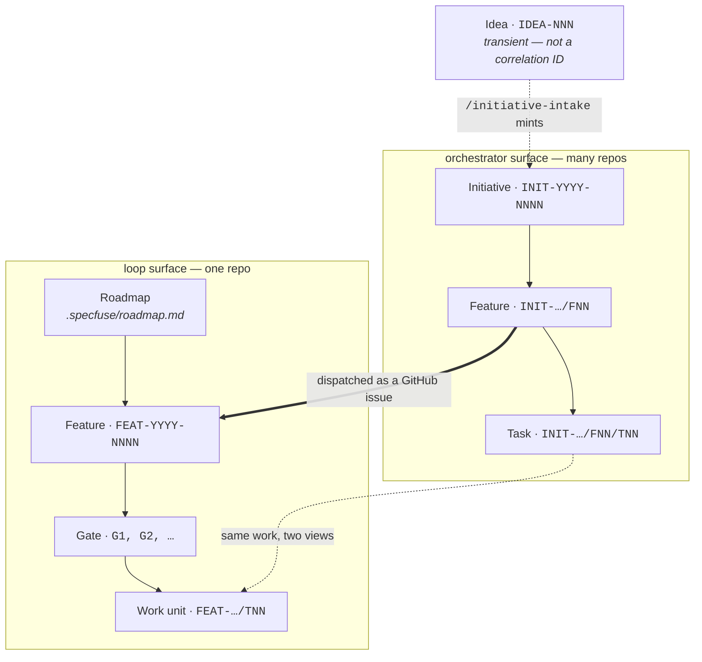
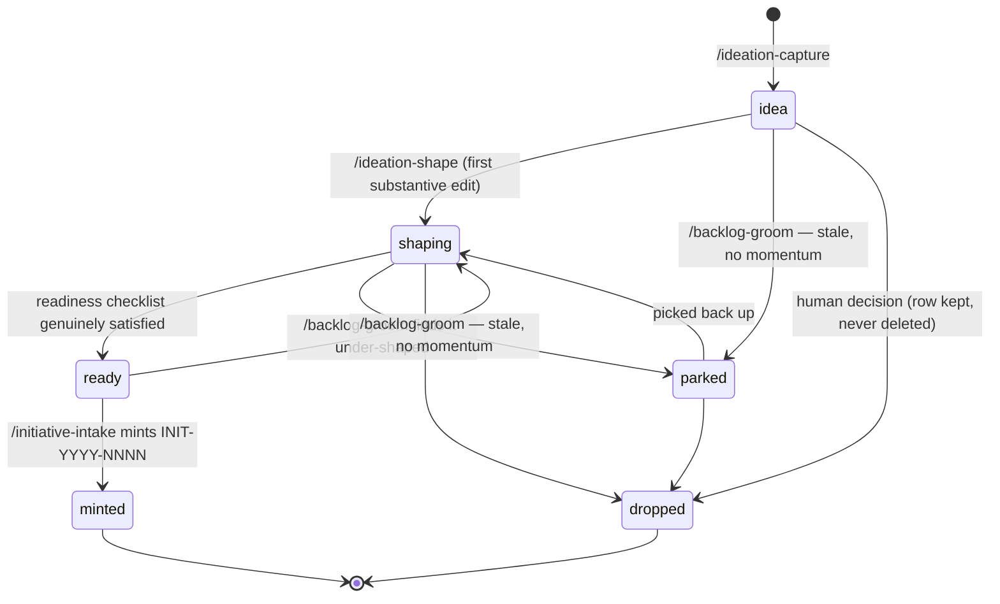
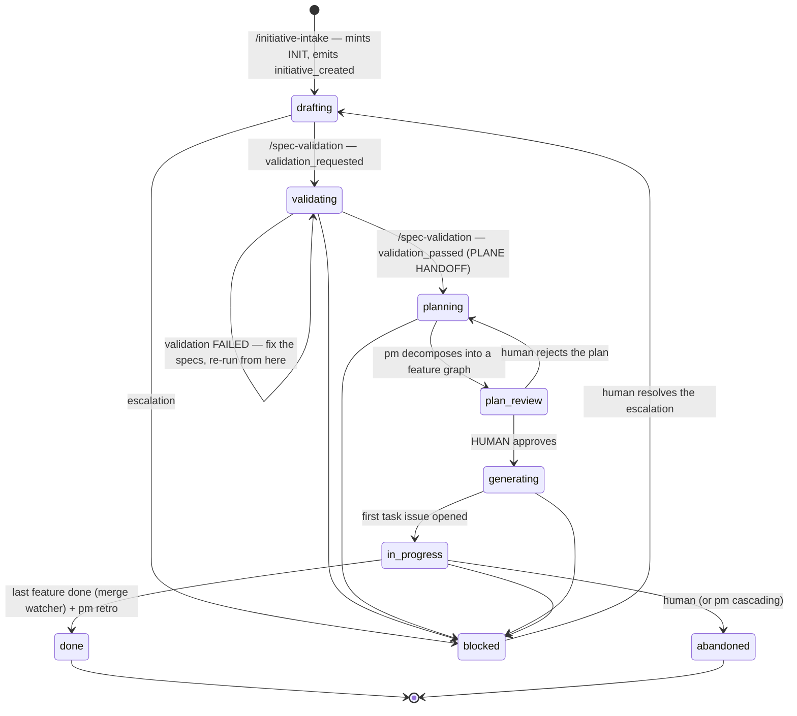
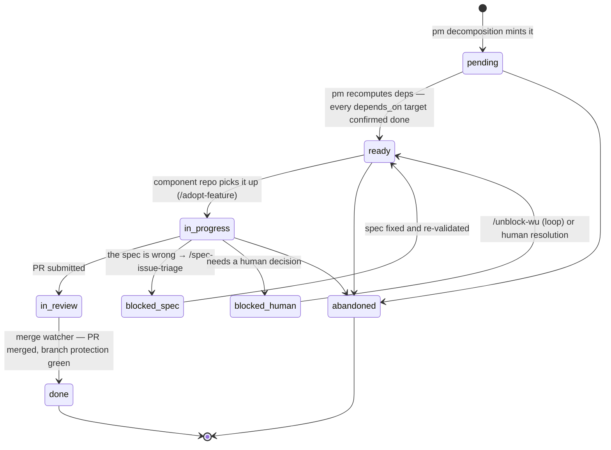
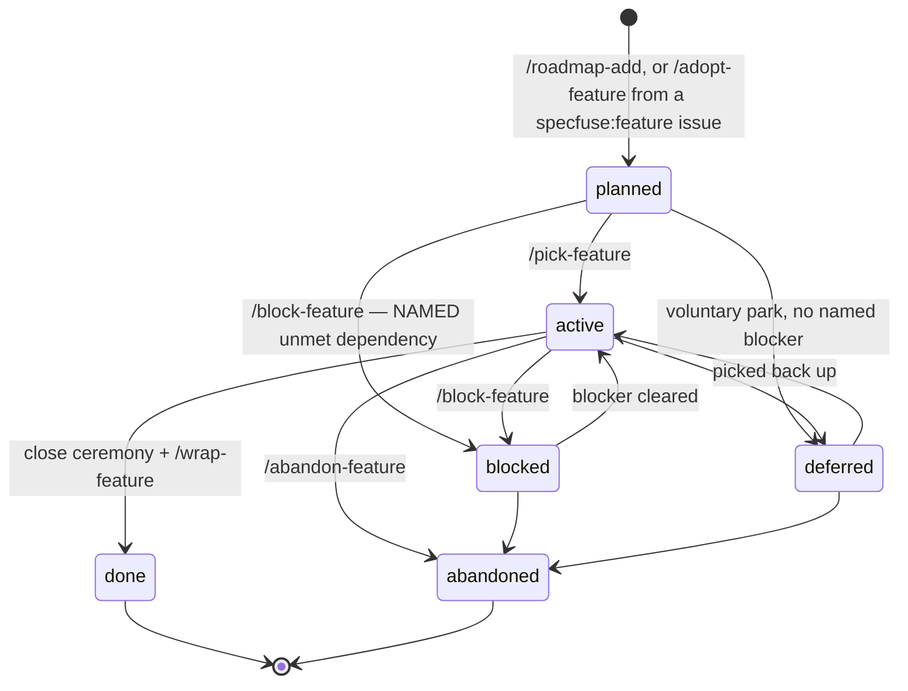
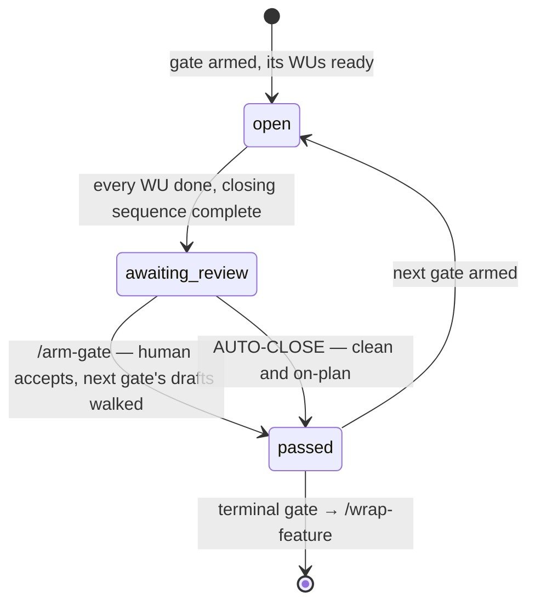
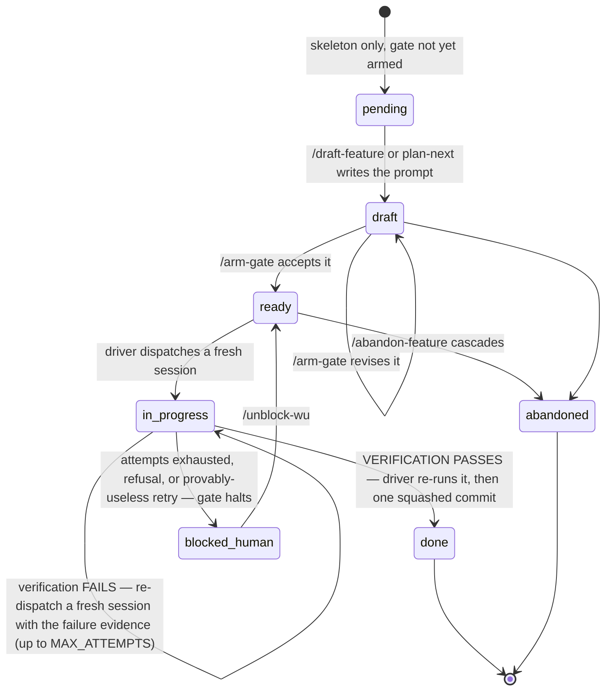

<!--
Copyright 2026 Specfuse Contributors
Licensed under the Apache License, Version 2.0. See LICENSE.
-->

# Unit lifecycles — states, transitions, and where each unit lives

Every unit Specfuse tracks, drawn as a state machine, with the file or issue that
holds its state and the role that owns each transition.

This file owns the **rendered state machines and the residency map**. The
canonical prose definitions live in
[`methodology/glossary.md`](../methodology/glossary.md) — where the two disagree,
the glossary wins. For the ordered path *through* these states, see
[`product-lifecycle.md`](product-lifecycle.md).

---

## 1. The unit stack

Which units exist depends on which surface you are on. The ID root tells you
where you are.



Read the two seams carefully:

- **A dispatched orchestrator feature *is* a loop feature.** One `INIT-…/FNN`
  becomes one feature folder in one component repo, and that repo's loop runs it
  as gates and work units.
- **A task and a work unit are the same work seen from two surfaces.** The
  orchestrator sees a GitHub issue; the loop sees a WU file.
- **A bare `INIT-YYYY-NNNN` is an initiative, not a feature.** Using it where a
  feature ID is expected is malformed and must be rejected.

The feature sits at a different altitude on each surface: **top** unit on the
loop (roadmap → feature → gate → WU), **mid-level** on the orchestrator
(initiative → feature → task).

## 2. Residency map — where state actually lives

| Unit | State lives in | Also written | Repo |
|---|---|---|---|
| **Idea** `IDEA-NNN` | `state:` frontmatter in `docs/product/backlog/IDEA-NNN-<slug>.md` + the matching row in `docs/product/INITIATIVE_BACKLOG.md` | — | product-specs |
| **Initiative** `INIT-YYYY-NNNN` | frontmatter of `/features/INIT-YYYY-NNNN.md` (the registry entry) | the event log at `/events/INIT-YYYY-NNNN.jsonl`; handoff manifest at `api/docs/handoffs/<id>.md` in the specs repo | orchestrator |
| **Orchestrated feature** `INIT-…/FNN` | registry entry + GitHub issue labels (`specfuse:feature`) | plan-review file | orchestrator + target repo's issues |
| **Task** `INIT-…/FNN/TNN` | GitHub issue labels | — | target component repo |
| **Loop feature** `FEAT-YYYY-NNNN` | status column + detail section in `.specfuse/roadmap.md` | `.specfuse/features/<id>-<slug>/PLAN.md` | component repo |
| **Gate** `G<n>` | `status:` frontmatter in `.specfuse/features/<id>-<slug>/GATE-0n.md` | — | component repo |
| **Work unit** `FEAT-…/TNN` | `status:` frontmatter in `.specfuse/features/<id>-<slug>/WU-NN-<slug>.md` | `.specfuse/features/<id>-<slug>/events.jsonl` (per-attempt outcomes) | component repo |

Two rules keep this honest:

- **One fact, one home.** The backlog row owns *state + pointer*; the dossier
  owns the content. The roadmap owns feature status; `PLAN.md` owns the plan.
  Duplicating either is drift waiting to happen.
- **The registry is not ground truth for target-repo state.** The PM re-verifies
  every claim about a component repo by inspecting that repo's issue at answer
  time, never from the registry or session memory.

A finished feature's records do not vanish: `/specfuse:roadmap-archive` moves the
detail section to `.specfuse/roadmap-archive.md` with a back-link, and the
feature folder stays.

## 3. Idea — `IDEA-NNN`

Pre-intake, product-specs repo only. Nothing here touches the orchestrator, emits
an event, or burns a correlation ID.



| Transition | Owner | Note |
|---|---|---|
| `→ idea` | `/specfuse-authoring:ideation-capture` | frictionless; a placeholder-only dossier is valid |
| `idea → shaping → ready` | `/specfuse-authoring:ideation-shape` | every clause traces to a file or a human answer |
| `ready → minted` | `/specfuse-authoring:initiative-intake` | the only transition that crosses planes |
| `→ parked`, `ready → shaping`, `→ dropped` | `/specfuse-authoring:backlog-groom` | writes the index only; never deletes a row or dossier |

Bundling is recorded, not a state: the lead dossier carries `bundles:`, each
follower `bundled_into:`, and the two must stay consistent. Several `ready` ideas
can mint into one initiative.

## 4. Initiative — `INIT-YYYY-NNNN`

The top, cross-repo, spec-driven unit — the whole thing a deploy decision turns
on. Exists **only** on the orchestrator surface; the loop has no initiatives.



| Transition | Owner |
|---|---|
| `drafting → validating`, `validating → planning` | **specs** agent (definition plane) |
| `planning → plan_review`, `generating → in_progress`, `in_progress → done` | **pm** agent (execution plane) |
| `plan_review → generating` | **human** — the approval gate; the pm never self-approves |
| `* → blocked` | any agent, on escalation |
| `* → abandoned` | human, or pm cascading |
| `blocked → <prior>` | human, by resolving the escalation |

A failed validation run emits **no** transition — the initiative stays in
`validating`, the human fixes the specs, and validation is re-run from there.
`/spec-validation` refuses to start from any state other than `drafting` or
`validating`, and guards `validating → planning` for idempotence by scanning
`/events/INIT-YYYY-NNNN.jsonl` for a prior emission.

`validating → planning` is the **plane handoff**: ownership moves from specs
(authoring) to pm (orchestrator). Note that the `INIT-` mint happens earlier, at
`drafting` — the mint is a cross-seam *write*, not the boundary itself.
([decision record](https://github.com/specfuse/orchestrator/blob/main/docs/decision-authoring-execution-boundary.md))

## 5. Feature

Two namespaces, two different state machines. Same concept, different altitude.

### 5a. Orchestrated feature — `INIT-YYYY-NNNN/FNN`

Produced by the pm decomposing an initiative; assigned to exactly one component
repo. Its state and the task state below share one enum — features and tasks are
both tracked as registry entries plus GitHub issues.



**The pm is the single writer of `pending → ready`.** It flips only after
inspecting each `depends_on` target's own issue and confirming `done` there —
never from the registry's cached view. That single-writer rule is what keeps a
multi-repo graph from advancing on a stale read.

### 5b. Loop feature — `FEAT-YYYY-NNNN`

The loop's native top unit: a standalone feature in one repo's roadmap, with no
initiative above it. Also the shape an adopted `INIT-…/FNN` takes once it lands
in a component repo.



`blocked` and `deferred` are both parked-but-resumable, and the driver skips both
exactly as it skips `abandoned`. The entire difference between them:

- **`blocked`** names and links its blocker — an ADR awaiting approval, or an
  upstream `FEAT-YYYY-NNNN` that must land first. Only `planned` or `active` may
  enter it, and the roadmap shows the dependency at a glance.
- **`deferred`** is a voluntary park with **no** named blocker.

`abandoned` is dead; the other two are alive. Parking properly is what keeps a
roadmap of nominally-active-but-stalled features from forming.

## 6. Gate — `G<n>`

A milestone partition of a feature: an ordered batch of substantive WUs, then a
mandatory closing sequence, then a human review-and-arm checkpoint. A loop
concept — the orchestrator's task graph is its multi-repo analogue.



**Auto-close** skips the human stop only under `auto` autonomy and only when
*all* hold: the structural lint passes, the not-yet-reached skeleton was not
revised, no task in the gate carries a `supervised` / auto-forbidden override,
and plan-next raised no escalation. Any failure stops the cycle for the human
regardless of mode, and escalation always overrides autonomy. Auto-arm advances
toward execution; it never auto-merges — the merge gate stays human.

Autonomy is set as a feature default and overridable per gate **tightening
only**: a gate may be more supervised than the feature default, never less.

## 7. Work unit — `FEAT-YYYY-NNNN/TNN`

One self-contained unit of work, sized for a single focused agent session. It
carries its own prompt and is the contract between planner and executor.



`in_review` is in the WU status enum but the loop's driver does not use it: it
writes `done` directly once it has re-run verification itself. The state belongs
to the orchestrator surface, where a PR sits between "work finished" and "work
merged".

**Verification is the exit oracle, and the driver re-runs it itself.** A unit
claiming done is not done; a unit whose verification the *driver* re-ran and
passed is. That re-run is the whole defense against the hollow pass.

Every dispatch is a **fresh context** — a WU that needs prior conversation to be
executable is mis-authored. See
[`/specfuse:authoring-work-units`](../plugins/specfuse/skills/authoring-work-units/SKILL.md).

Per-attempt outcome events land in the feature's `events.jsonl`; that file is
what `/specfuse:gate-status`, `/specfuse:learnings-suggest`, and `specfuse stats`
read.

### WU id forms

```
FEAT-YYYY-NNNN/TNN            # substantive
FEAT-YYYY-NNNN/TNNH[N…]       # hygiene — precursor to a target substantive WU
FEAT-YYYY-NNNN/G<n>-CLOSE     # terminal gate, single-WU close
FEAT-YYYY-NNNN/G<n>-CLOSE-INTERMEDIATE + /G<n>-PLAN   # non-terminal, two-WU close
FEAT-YYYY-NNNN/G<n>-(RETRO|LESSONS|DOCS|PLAN)         # legacy four-WU close (accepted, WARN)
```

Orchestrated equivalents replace the `FEAT-YYYY-NNNN` root with
`INIT-YYYY-NNNN/FNN`. Full regex and minting rules:
[`rules/correlation-ids.md`](../methodology/rules/correlation-ids.md).

## 8. The correlation ID threads all of it

```
Component-local:   FEAT-YYYY-NNNN[/(TNN[H[N…]] | G<n>-(RETRO|LESSONS|DOCS|PLAN|CLOSE-INTERMEDIATE|CLOSE))]
Orchestrated:      INIT-YYYY-NNNN/FNN[/(TNN[H[N…]] | G<n>-(…))]
Initiative (bare): INIT-YYYY-NNNN        # an initiative, NOT a feature
```

The same ID appears in the feature folder name, the WU file, every `events.jsonl`
entry, the branch name, the commit trailer (`Feature: FEAT-YYYY-NNNN/TNN`), and
the GitHub issue. `YYYY` is the creation year; `NNNN` is a zero-padded ordinal
that resets per year.

That thread is the reason a merged commit can be traced back to the idea someone
captured in a backlog months earlier — and the reason `IDEA-NNN`, which is
transient and stops at the mint, is deliberately *not* part of it.

## 9. Where to read next

| Read | For |
| --- | --- |
| [`product-lifecycle.md`](product-lifecycle.md) | The ordered path through these states, with the command that moves each step. |
| [`methodology/glossary.md`](../methodology/glossary.md) | The canonical prose definitions these diagrams render. |
| [`methodology/methodology.md`](../methodology/methodology.md) | The gate cycle, the five-section WU contract, auto-close, autonomy. |
| [`methodology/rules/correlation-ids.md`](../methodology/rules/correlation-ids.md) | The ID format and minting rules. |
| [`ways-of-working.md`](ways-of-working.md) | Which states demand human attention, and the failure modes around each. |
