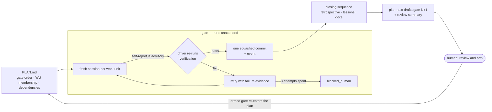
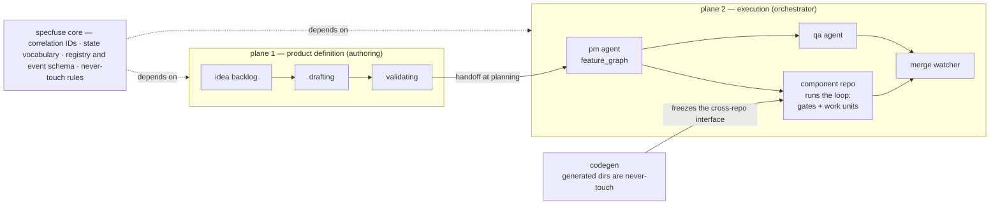

<!--
Copyright 2026 Specfuse Contributors
Licensed under the Apache License, Version 2.0. See LICENSE.
-->

# Specfuse in one read

The front door to this folder. [`methodology.md`](methodology.md) is the
contract — precise, complete, and written for implementers. This file is the
orientation you read *first*: what the method bets on, how it maps onto the
software lifecycle you already know, and how the projects fit together.

It deliberately states no contract of its own. Every rule below lives somewhere
canonical, and this file links there rather than restating it.

---

## 1. The bet

AI coding agents do well on narrow, well-scoped work and poorly on large, vague
work. Specfuse's bet is that **the leverage is in the planning**: remove
ambiguity up front — crisp work units with hard boundaries and machine-checkable
verification — and execution can then run with a fresh agent per unit,
re-grounding from durable files each time instead of accumulating context drift.

Two properties carry most of the weight:

- **Verification is the exit oracle.** The executing session's self-report is
  advisory; the driver re-runs the unit's verification and *that* decides `done`.
- **Gates are human checkpoints by design.** The driver runs unattended *within*
  a gate and stops *at* it — and what the human reviews there is the *next*
  gate's draft.

Lineage and what this is not: [`loop/docs/concepts/ralph-lineage.md`](https://github.com/specfuse/loop/blob/main/docs/concepts/ralph-lineage.md).

## 2. The five nouns

| Unit | What it is |
| --- | --- |
| **Roadmap** | The master index of features for a repo, each with a status. |
| **Initiative** `INIT-YYYY-NNNN` | The top, cross-repo, spec-driven unit — the whole thing a deploy decision turns on. Orchestrator surface only. |
| **Feature** `FEAT-YYYY-NNNN` or `INIT-…/FNN` | A spec-driven or directly-authored unit of value. Owns an ordered list of gates. |
| **Gate** | A milestone partition of a feature: substantive work units, then a closing sequence, then a human review-and-arm checkpoint. |
| **Work unit** `FEAT-…/TNN` | One self-contained unit, sized to finish in a single focused agent session. Carries its own prompt. |

One correlation ID threads the whole lifecycle: the feature folder, the WU file,
every event-log entry, the branch, the commit trailer, and (on the orchestrator
surface) the GitHub issue. Origin is read from the ID root — `INIT-…` is
orchestrated, `FEAT-…` is component-local.

Full definitions, state machines, and transition ownership: [`glossary.md`](glossary.md).

## 3. The gate cycle

Four steps per gate — **plan, execute, close, review-and-arm** — repeated until
the feature is done. Two details worth knowing before you read the contract:

- **Ceremony scales with size.** Four or fewer planned substantive work units
  means one gate with one terminal close.
- **Clean gates skip the ceremony.** A deterministic predicate at every gate
  boundary auto-closes gates that stayed on-plan; anything off-plan falls back to
  the full reflective close automatically.

Both, in full: [`methodology.md` §3 and §6](methodology.md).

## 4. Mapped onto a classical SDLC

Every classic phase still happens. What changes is who performs it, at what
cadence, and what counts as evidence that it happened. This mapping is an
orientation aid — the contract defines the cycle on its own terms and does not
frame itself against a phase model.

| Classic phase | Where it lives in Specfuse | What actually changes |
| --- | --- | --- |
| Requirements | Idea backlog in the product-specs repo (capture, shape, groom) | Ideas carry no number until picked. Minting `INIT-YYYY-NNNN` *is* the deploy decision — a discrete human moment. |
| Analysis & design | Spec drafting and validation, driving `drafting → validating → planning` | The design artifact is machine-validatable and machine-consumable. Codegen turns it into source, so cross-component interfaces are frozen rather than agreed. |
| Planning / WBS | `PLAN.md` — gate order, WU membership, dependency edges | **The planning horizon is one gate.** Detail for gate N+1 is authored after gate N closes, informed by what gate N actually cost. Re-planning is the normal path, not a change request. |
| Implementation | `implementation` work units, one fresh session each, one squashed commit per unit | No long-lived working context. Every durable fact lives in the plan, the WU files, git history, and the event log. |
| Testing / QA | `qa_authoring`, `qa_execution`, `qa_curation` work units in the same dependency graph | QA is in-band work units, not a downstream stage. Separately, the driver re-runs verification on *every* unit as the exit oracle. |
| Code review | Branch protection and PR review, unchanged — plus the gate review-and-arm checkpoint | The highest-leverage human review moves *earlier*: reviewing the next gate's draft catches a misframed gate before it becomes merged code. |
| Release | Merge watcher closes on PR merge; the terminal close reconciles docs and roadmap | Merge stays human. Auto-arm advances work toward execution but never merges it. |
| Retrospective | A closing work unit per gate, plus promotion of durable rules to `LEARNINGS.md` | Retro output is read back at planning time. It is an input to the process, not an archived document. |
| Change control | `replan` events, `blocked_human` escalation, re-arm history with cumulative cost | Deviation is recorded as structured events, and those events feed the auto-close predicate — going off-plan mechanically buys back human oversight. |

**What does not change:** pull requests, branch protection, the test suite, the
security scan, human merge approval. The loop's `code` verification set is kept
in lock-step with branch protection wherever both exist — a unit that passes its
own checks but would fail the real gate has done the wrong thing.

## 5. What actually differs

Six claims. If a reader remembers nothing else, these carry the method.

1. **Done is re-derived, not reported.** The driver re-runs verification itself.
2. **Fresh context per dispatch.** Nothing important lives in a context window.
3. **The planning horizon is one gate.** `plan-next` authors the next gate's
   detail after seeing what the last one cost, and may re-scope gates not yet
   reached — never one already passed.
4. **Human time moves to the plan.** `plan-next` drafts but never arms. The
   review summary is weighted toward *doubt*, not completeness.
5. **Learning is a file, not a memory.** `LEARNINGS.md` is read at planning time,
   so each plan is better than the last.
6. **Oversight is earned back by evidence.** Clean, on-plan gates cost less
   ceremony; a block, a replan, or a cost overrun mechanically re-enables the
   full close and the human stop.

## 6. How the parts collaborate

- **The seam is the `validating → planning` handoff.** Minting the initiative
  happens *before* the seam, on the authoring side, and reaches across to write
  the shared registry — the mint is a cross-seam write, not the boundary.
  ([decision record](https://github.com/specfuse/orchestrator/blob/main/docs/decision-authoring-execution-boundary.md))
- **Gates live in the loop, not the orchestrator.** Each dispatched
  implementation feature *is* a loop feature. The orchestrator owns
  initiative→feature decomposition and cross-repo ordering; it does not identify
  gates, run `plan-next`, or hold a per-gate review.
  ([addendum](concepts/architecture-addendum-gates-and-iterative-planning.md))
- **Neither plane imports the other.** Both depend on core, which is where the
  shared contract ships from.
- **Each project is independently adoptable.** The loop is usable in one repo
  with no specs and no orchestrator; the orchestrator earns its keep only when
  work genuinely spans repos.

Surface-by-surface differences (state backend, dispatch, branch/merge, spec
front-end): [`methodology.md` §10](methodology.md).

## 7. Where to read next

| Read | For |
| --- | --- |
| [`methodology.md`](methodology.md) | The gate-cycle contract in full — the canonical source for everything above. |
| [`glossary.md`](glossary.md) | Every unit defined once, plus lifecycle state machines and transition ownership. |
| [`rules/`](rules/) | The enforceable rules: borrowed vocabularies, correlation IDs, never-touch, role-switch hygiene, security boundaries, verification discipline. |
| [`docs/product-lifecycle.md`](../docs/product-lifecycle.md) | The end-to-end path: idea → initiative → specs → handoff → features → merged code, and the command at each step. |
| [`docs/unit-lifecycles.md`](../docs/unit-lifecycles.md) | The state machines, drawn: every state of an idea, initiative, feature, gate, WU and task, plus where each record lives. |
| [`docs/ways-of-working.md`](../docs/ways-of-working.md) | The operating manual: cadences, who does what, and the failure modes to watch for. |
| [orchestrator vision](https://github.com/specfuse/orchestrator/blob/main/docs/orchestrator-vision.md) | Why the execution plane exists, what it isn't, and its five principles. |
| [loop getting-started](https://github.com/specfuse/loop/blob/main/docs/getting-started.md) | A narrated first feature, end to end. |
