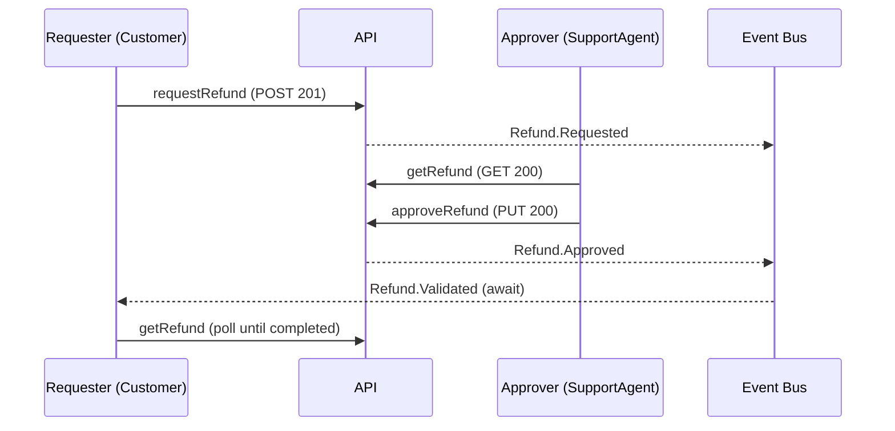

<!--
Copyright 2026 Specfuse Contributors
Licensed under the Apache License, Version 2.0. See LICENSE.
-->

Interactively design a new Arazzo scenario from PM intent, walking through a structured 11-step flow that produces a validated scenario file.

*Enforces: .specfuse/authoring/handbooks/Arazzo_Handbook.md*

**Before writing any files**, read and internalize the authoritative rules:
1. Read `.specfuse/authoring/handbooks/Arazzo_Handbook.md` -- the full handbook
2. Read `.specfuse/authoring/samples/scenario-samples.yaml` -- canonical scenario template
3. Read `.specfuse/authoring/samples/recipe-samples.yaml` -- canonical recipe template (for understanding x-setup wiring)
4. Note the input/output contract of the `scenario-architect` subagent (provided by the specfuse-authoring plugin) -- you will delegate generation to it
5. Note the report format of the `scenario-validator` subagent (provided by the specfuse-authoring plugin) -- you will delegate validation to it

## What this command produces

A single Arazzo 1.0.1 scenario file (`.arazzo.yaml`) placed in:
- `api/specs/v1/domains/{domain}/scenarios/` for domain scenarios
- `api/specs/v1/scenarios/cross-domain/` for cross-domain scenarios

The scenario is generated by the `scenario-architect` sub-agent and validated by the `scenario-validator` sub-agent. This command handles all user interaction and delegates heavy lifting to those agents.

## The 11-step interactive flow

Work through these steps in order. Each step has a clear interaction point -- present information, ask for confirmation, then move on. Do not skip steps. Do not batch multiple steps into a single response unless the user explicitly asks to accelerate.

---

### Step 1: Gather intent

Ask the user to describe the use case in 2-3 sentences. Guide them with:

> "Describe the use case you want to model. What triggers it, who is involved, and what is the expected outcome?"

From the response, identify:
- The **core action** (e.g., "process a refund", "finalize an order", "archive stale records")
- The **trigger** (user action, cron job, upstream event)
- The **expected outcome** (state change, notification, generated artifact)
- Whether this is a **happy path**, a **failure test**, or both

Present your understanding back to the user and confirm before proceeding.

---

### Step 2: Map to domain

Based on the intent, propose a kebab-case domain name from the project's active domain list (defined in the project's overlay).

If the use case spans multiple domains, propose `cross-domain` and confirm file placement under `scenarios/cross-domain/`.

Present the proposed domain and confirm with the user.

---

### Step 3: Scan OpenAPI and AsyncAPI

Read the target domain's specs to build inventories:

1. **Operations inventory**: Glob `api/specs/v1/domains/{domain}/operations/*.yaml` and extract every `operationId`. For cross-domain scenarios, also scan the relevant secondary domains.
2. **Events inventory**: Glob `api/specs/v1/domains/{domain}/messages/*.yaml` and extract every `x-label` as `{Entity}.{Action}`. Also check OpenAPI operations for `x-emits` to identify write-triggered events.
3. **Existing scenarios**: Glob `api/specs/v1/domains/{domain}/scenarios/*.arazzo.yaml` and list their workflowIds and step operationId sequences (for the granularity check later).
4. **Existing recipes**: Glob `api/specs/v1/scenarios/setup-recipes/**/*.recipe.yaml` and list their file stems and output keys.

Present the candidate operations and events to the user as a numbered list, organized by type:
- **Read operations** (GET endpoints)
- **Write operations** (POST/PUT/PATCH/DELETE) with their `x-emits` events
- **Available events** (from AsyncAPI messages)

Highlight which operations and events seem relevant to the use case described in step 1. Ask the user to confirm which ones the scenario will use, and flag any that are missing:

> "I found these operations and events in the {domain} domain. Which ones apply to your scenario? If the operation you need is missing, we will need to design it in OpenAPI first."

---

### Step 4: Confirm actors

Based on the use case, propose actors from the project's closed role enum (defined in the OpenAPI common enums file, typically `common/enums.yaml`).

Many projects include an `Authenticated` role for pre-business-role flows (signup, invitation acceptance) — check whether the project's enum declares it before using it. The other roles vary by project.

For each actor, propose:
- A **camelCase key** (e.g., `requester`, `manager`, `approver`, `observer`)
- A **role** from the closed set
- A **description** of their role in this scenario

For scheduled-job scenarios (cron-triggered, no human initiator), explain that the actor serves as an **observer** who verifies outcomes, not an initiator. Use `x-as: $observer` on verification steps.

Present the actor list and confirm:

> "Here are the actors I propose for this scenario. Confirm or adjust their roles and keys."

---

### Step 5: Walk through steps

Build the step sequence one step at a time. This is the longest part of the flow -- for each step:

1. **Propose** the step based on the use case and the confirmed operations:
   - `stepId` (kebab-case)
   - `operationId` (from the inventory, or omitted for standalone `x-async.await`/`x-async.poll` steps)
   - `x-as` (which actor performs this step)
   - Key request parameters and body fields (using `$setup.outputs.X`, `$steps.{id}.outputs.X`, or `$inputs.X` expressions)
   - Expected status code (matching OpenAPI: GET->200, POST->201, PUT/PATCH->200, DELETE->204)
   - Outputs to extract (e.g., `refundId: $response.body#/id`)
   - Async assertions if the operation emits events (`x-async.emit`) or the step needs to wait for an event (`x-async.await`) or poll (`x-async.poll`)

2. **Present** the step in a readable summary (not raw YAML -- keep it conversational):

   > **Step 3: Create refund request** (as `$requester`)
   > - Calls `requestRefund` (POST, expects 201)
   > - Body: orderId, lineId from setup
   > - Outputs: refundRequestId
   > - Emits: `Refund.Requested` (timeout 10s)

3. **Confirm** with the user before moving to the next step. Accept corrections (different actor, different operation, additional outputs).

After all steps are confirmed, summarize the full step sequence and ask for a final confirmation:

> "Here is the complete step sequence. Does this match the flow you have in mind? Any steps to add, remove, or reorder?"

---

### Step 6: Elicit failure modes

Ask explicitly about failure paths:

> "What should happen if any of these steps fail? Are there specific error scenarios to test (e.g., validation failures, permission errors, duplicate requests)?"

For each identified failure mode, determine whether it should be:
- A **step-level `onFailure`** block (single expected-error step within an existing workflow)
- A **separate workflow** in the same file (if it produces a meaningfully different Mermaid sequence diagram)
- A **workflow-level `failureActions`** default (if all steps share the same failure behavior)

Apply the Mermaid diagram test: if the failure path has the same steps as the happy path with only one step's outcome differing, use `onFailure` on that step. If the failure path has a meaningfully different step sequence, create a separate workflow.

---

### Step 7: Collect x-ui actions

For each step that has a user-facing interaction, ask:

> "For the '{stepId}' step, what does the user see and do in the UI? Describe the page, the actions they take, and what they expect to see after."

Collect:
- **Platform**: web, mobile, or any
- **Page**: the route where this happens (e.g., `/orders`)
- **Actions**: ordered natural-language descriptions of what the user does (each gets a kebab-case `id`)
- **Expect**: what the user sees after the step (visual outcomes)
- **Playwright selectors**: only if the user provides concrete selectors. Do NOT guess at selectors.

If the user says the scenario has no UI steps, skip this step entirely.

---

### Step 8: Generate YAML

Delegate to the `scenario-architect` sub-agent. Spawn a single Agent with the following structured context gathered from steps 1-7:

**Required inputs to include in the agent prompt:**
- `domain`: the confirmed domain
- `intent`: the PM's original use case description from step 1
- `actors`: the confirmed actor list with keys, roles, and descriptions
- `steps`: the confirmed step sequence with operationIds, actors, parameters, outputs, and async assertions
- `operationIdInventory`: all operationIds found in step 3
- `eventInventory`: all `{Entity}.{Action}` event names found in step 3
- `existingScenarios`: scenario files and their step sequences from step 3
- `existingRecipes`: recipe file stems and output keys from step 3

**Optional inputs (include when available):**
- `failureModes`: failure paths from step 6
- `uiActions`: UI action descriptions from step 7
- `tags`: any tags the user mentioned (e.g., `critical-path`)

**Tell the agent to:**
1. Read `.specfuse/authoring/handbooks/Arazzo_Handbook.md` and `.specfuse/authoring/samples/scenario-samples.yaml`
2. Follow the generation process the `scenario-architect` subagent (provided by the specfuse-authoring plugin) defines
3. Return the complete YAML content and the proposed file path
4. Report any gaps found (missing operationIds, events, recipes)

**Setup recipe selection**: before spawning the agent, check the existing recipes from step 3. If no recipe provides the outputs the scenario needs (actor entity IDs, resource IDs):
- STOP and tell the user:

  > "This scenario needs setup fixtures that no existing recipe provides. The following outputs are needed: [{list}]. Please run `/design-recipe` to create a recipe first, then return to `/design-scenario`."

- Do not proceed until the recipe gap is resolved.

If the architect agent reports gaps (missing operationIds, events, or a granularity violation >= 80% overlap), surface them to the user and stop. These are blocking issues that must be resolved before the scenario can be written.

---

### Step 9: Validate

After the architect produces the YAML, write it to a temporary location and delegate validation to the `scenario-validator` sub-agent.

Spawn the `scenario-validator` subagent (provided by the specfuse-authoring plugin), which:
1. Applies its validation pipeline and report format
2. Runs the validation pipeline against the generated file:
   - `./scripts/specfuse/validate-arazzo-spectral.sh` (Spectral lint)
   - `./scripts/specfuse/validate-arazzo.sh` (structural + cross-spec checks)
3. Returns a structured validation report

Process the report:
- **Auto-fix mechanical issues silently**: missing `x-version` defaults, missing `x-mcp: { exposed: false }`, casing fixes, ISO duration format corrections. Apply these to the YAML without asking the user.
- **Surface judgment calls to the user**: unresolved operationIds, invalid actor roles, event name mismatches, granularity alerts. Present each issue and ask how to proceed.
- **Re-validate after fixes** until the report shows zero errors.

If validation reveals issues that require design changes (wrong operationId, missing event), go back to the relevant earlier step (step 3 or step 5) and rework.

---

### Step 10: Mermaid sanity check

Generate a Mermaid sequence diagram from the scenario's step sequence. For each workflow in the file, produce a diagram showing:
- **Actor swimlanes** (participants named by actor key and role)
- **Step arrows** (from actor to API, labeled with the operationId or action)
- **Event annotations** (async emit/await/poll shown as notes or dashed arrows)
- **Failure branches** (if separate failure workflows exist)

Present the Mermaid markdown in a fenced code block so the terminal renders it:

````

````

Ask the user:

> "Does this diagram match the flow you described? Any steps out of order or missing?"

If the user identifies issues, go back to step 5 and adjust the step sequence, then regenerate (steps 8-10).

---

### Step 11: Write file

Save the validated scenario file to its final location:
- Domain scenario: `api/specs/v1/domains/{domain}/scenarios/{use-case-name}.arazzo.yaml`
- Cross-domain: `api/specs/v1/scenarios/cross-domain/{use-case-name}.arazzo.yaml`

Report:
- The file path
- A summary of what was created (number of workflows, steps, actors, events)
- Suggested next steps:
  - Run `/review-scenario` for an independent second opinion on quality and granularity
  - Run `/validate` to verify no regressions in the broader spec suite
  - If the scenario has `critical-path` tag, note that it will block PR merges once test generation is in place

---

## Post-flow checklist

Verify all of these before reporting completion:

- [ ] Scenario file written to the correct directory
- [ ] All `operationId` values confirmed against OpenAPI
- [ ] All `{Entity}.{Action}` event names confirmed against AsyncAPI
- [ ] Status code assertions match OpenAPI conventions (GET->200, POST->201, PUT/PATCH->200, DELETE->204)
- [ ] `x-version` present with `current: 1` and `status: draft`
- [ ] `x-domain` present and matches the confirmed domain
- [ ] `x-doc.summary` present and PM-readable
- [ ] `x-mcp.exposed` explicitly set
- [ ] `x-actors` present with at least one actor, all roles from the closed set
- [ ] `x-as` present on every scenario step
- [ ] `x-setup` recipe exists and provides all needed outputs (or gap flagged)
- [ ] Granularity check passed (no >= 80% step overlap with existing scenarios)
- [ ] Mermaid diagram reviewed by the user
- [ ] Validation passes with zero errors
- [ ] No hardcoded dates -- date tokens (`@today+3d`) used throughout
- [ ] No language-specific references (no class names, namespaces, package paths)
- [ ] No top-level `x-emits` (Arazzo uses `x-async.emit` on steps)
- [ ] No channel addresses in `x-async` (channels are derived)

## Tips for good scenarios

- **One file = one use case.** If two scenarios would produce the same Mermaid diagram, merge them into one scenario with input parameters for data variation.
- **Workflows for step-sequence variants, not data variants.** Use separate workflows for "manager approves" vs "manager rejects" (different steps). Use input parameters for "morning order" vs "evening order" (same steps, different data).
- **Assert observable outcomes for AI workers.** Use `x-async.await` for the terminal event and `x-async.poll` or GET steps for the resulting REST state. Never assert prompt content, model choice, or token counts.
- **Use date tokens, not hardcoded dates.** `@today+3d`, `@now-1h`, `@today+2w@America/Montreal`. Date tokens resolve only in `x-setup.inputs`, workflow `inputs` defaults, step `requestBody.payload`, and step `parameters` values.
- **Keep `x-doc.summary` PM-readable.** Write for the product manager, not the developer. Avoid jargon, acronyms, and implementation details.
- **Tag `critical-path` sparingly.** Only scenarios that must block PR merges deserve this tag. Overuse dilutes its value and slows CI.
- **Recipes are infrastructure.** If the scenario needs fixtures that no recipe provides, create the recipe first with `/design-recipe`. Do not inline fixture creation in the scenario.
- **Failure modes deserve explicit attention.** Step 6 exists because failure paths are often where the most important behavior lives. Do not skip it.
